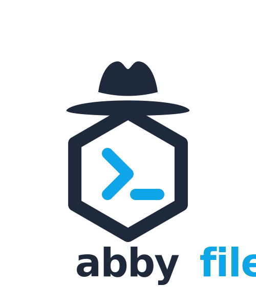

<p align="center">
  
</p>

<h1 align="center">Abbyfile</h1>

<p align="center"><strong>A packaging format for AI agents.</strong></p>

<p align="center">
  <a href="https://github.com/teabranch/abbyfile/actions/workflows/ci.yml"></a>
  <a href="https://github.com/teabranch/abbyfile/releases"></a>
  <a href="LICENSE"></a>
  
</p>

--- Build, version, and distribute focused agents as standalone binaries — with MCP auto-discovery built in.

Abbyfile turns agent definitions — a system prompt, tools, and memory — into versioned, distributable CLI binaries. Authors publish to GitHub Releases. Consumers install with one command. Claude Code auto-discovers the rest.

No Go code. No manual config. Just `abby build`.

## Why We Built This

CLAUDE.md files are great for single-repo instructions, but they don't version, don't distribute, and can't carry tools or memory. Agent Skills add progressive disclosure but still lack executable tools and persistent state. Sub-agents provide context isolation but re-pay Claude Code's ~9.2K baseline on every invocation. MCP servers solve the tool problem but weren't designed with context efficiency in mind — broad platform-wrapper servers can consume a significant portion of your context window on every turn.

We wanted agents that follow the Unix philosophy: small, focused, composable. Each agent does one thing well with 6-15 purpose-built tools, keeping context overhead minimal while remaining easy to build, test, and share as real software.

The result is a packaging format that gives agents the same lifecycle as any other software artifact: build, test, version, publish, install, update — at marginal context cost on the existing window, with no baseline re-payment.

We've benchmarked the context cost against skills, sub-agents, and broad MCP servers extensively. See **[our benchmark methodology and results](docs/guides/benchmarks.md)** for the full analysis.

## How It Works

**Agents are repos.** An `Abbyfile` manifest plus markdown definitions, versioned and released like any other software. See [`examples/`](examples/) for complete working setups.

```
my-agent/
  Abbyfile              # declares agents + versions
  agents/my-agent.md     # system prompt + tool/memory config
```

**Three commands, start to finish:**

```bash
# 1. Build — compiles a standalone binary from YAML + markdown
abby build
abby build --plugin  # also generate a Claude Code plugin (with skills)

# 2. Publish — cross-compiles and creates a GitHub Release
abby publish

# 3. Install — one command, any machine, done
abby install github.com/acme/my-agent

# Or install all agents from a repo at once
abby install --all github.com/acme/agent-suite
```

That last command downloads the right binaries for your platform, wires them into your MCP-compatible runtime (Claude Code, Codex, Gemini CLI — auto-detected), and tracks them for future updates. No cloning, no building from source, no editing config files.

**Claude Code is the brain. The binary is the body** — it provides the instructions, the hands (tools), and the memory. Claude Code loads the agent's prompt, discovers its tools via MCP, and handles all reasoning.

```
Claude Code (LLM Runtime)
  |
  |  MCP-over-stdio
  v
Agent Binary
  +-- --custom-instructions  -> system prompt
  +-- serve-mcp              -> MCP server (tools + memory)
  +-- config get|set|reset   -> runtime config overrides
  +-- --version              -> semver
  +-- --describe             -> JSON manifest
  +-- validate               -> check wiring
```

## Quick Start

### 1. Define your agent

**`Abbyfile`**
```yaml
version: "1"
agents:
  my-agent:
    path: agents/my-agent.md
    version: 0.1.0
```

**`agents/my-agent.md`** — dual frontmatter + system prompt:
```markdown
---
name: my-agent
memory: project
---

---
description: "A helpful coding assistant"
tools: Read, Write, Bash
---

You are a helpful coding assistant. Use your tools to read and modify files.
```

### 2. Build and use

```bash
abby build
# -> ./build/my-agent binary + MCP config for detected runtimes

# Your runtime auto-discovers the agent — start using it immediately
```

### 3. Share it

```bash
# Publish to GitHub Releases (cross-compiled for macOS + Linux)
abby publish

# Anyone can install it with one command
abby install github.com/you/my-agent
```

## What You Get

| | CLAUDE.md | Agent Skills | Sub-agents | Abbyfile |
|---|---|---|---|---|
| **Context cost** | File size | ~3KT loaded | ~10.6KT/call (baseline re-paid) | ~1.5KT marginal |
| **Custom tools** | Described in prose | No | Inherited from parent | Registered, validated, executable via MCP |
| **Persistent memory** | None | None | None | Key-value store per agent |
| **Versioning** | Git history | None | None | Semantic versioning, pinnable releases |
| **Distribution** | Copy the file | Folder copy | N/A | `abby install` from anywhere |
| **Context isolation** | No | No | Yes | No |
| **Cost model** | One-time | Text in context | Baseline per call | Marginal per turn |
| **Runtime config** | Edit the file | N/A | N/A | `config set model opus` — override without rebuilding |

## Runtime Configuration

Agents ship with compiled defaults, but consumers can override settings without rebuilding:

```bash
# Override the model hint at install time
abby install --model opus github.com/acme/my-agent

# Or change it later
./my-agent config set model opus
./my-agent config get model          # opus (override)
./my-agent config reset model        # revert to compiled default

# Show all config (compiled defaults + overrides)
./my-agent config get
```

Overrides are stored at `~/.abbyfile/<name>/config.yaml`. The model hint is surfaced to the runtime via MCP server instructions. See the [model-override example](examples/model-override/) for a complete setup.

## Install

```bash
# Pre-built binary (easiest)
curl -sSL https://raw.githubusercontent.com/teabranch/abbyfile/main/install.sh | sh

# Go users
go install github.com/teabranch/abbyfile/cmd/abby@latest

# From source
git clone https://github.com/teabranch/abbyfile.git && cd abbyfile
make build && make install
```

## Documentation

| Guide | Description |
|-------|-------------|
| **[Quickstart](docs/quickstart.md)** | Build an agent in 5 minutes |
| **[Concepts](docs/concepts.md)** | Architecture and mental model |
| **[Abbyfile Format](docs/guides/abbyfile-format.md)** | YAML manifest + agent .md reference |
| **[Tools](docs/guides/tools.md)** | Built-in tools, custom CLI tools, annotations |
| **[Memory](docs/guides/memory.md)** | Persistent key-value storage |
| **[Prompts](docs/guides/prompts.md)** | Embedding and overriding prompts |
| **[Distribution](docs/guides/distribution.md)** | Publish, install, update, uninstall |
| **[Plugins](docs/guides/plugins.md)** | Claude Code plugin output with skills |
| **[MCP Integration](docs/guides/mcp.md)** | Claude Code integration via MCP |
| **[Testing](docs/guides/testing.md)** | Unit, integration, and MCP testing |
| **[Benchmarks](docs/guides/benchmarks.md)** | Token cost methodology and results |
| **[Reference](docs/reference.md)** | All options, subcommands, flags, types |
| **[Examples](examples/)** | Working agent configurations |
| **[FAQ](docs/faq.md)** | Common questions |
| **[Development](docs/development.md)** | Contributing to Abbyfile |

## Status

Alpha. Core framework and declarative build system implemented. API may change before v1.0.

## License

See [LICENSE](LICENSE).
